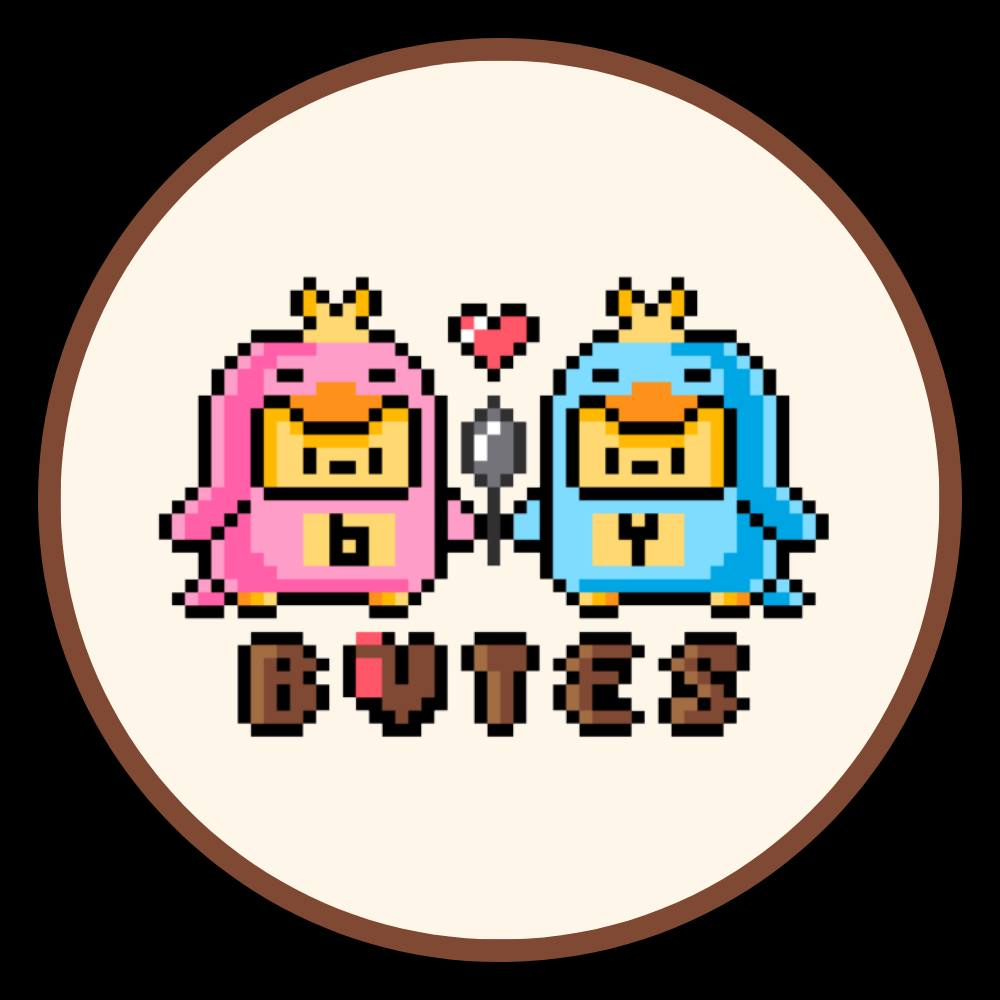

# Bites-by-Bytes
Plates paint progress, one byte at a time

<video width="640" height="360" controls>
  <source src="https://github.com/glennquah/Bites-by-Bytes/raw/main/Bytesforbytes%20vid.mp4" type="video/mp4">
  Your browser does not support the video tag.
</video>

# Description
---
**Bytes By Bytes** is a revolutionary digital platform dedicated to meal tracking, catering to a diverse array of users such as mothers overseeing their children's nutrition, individuals battling anorexia seeking encouragement, and partners aiming to stay connected through shared meals. Users can effortlessly log their meals online with succinct descriptions, while the platform's collaborative features enable connections between family, friends, and partners. By facilitating meal transparency and communication, "Bytes By Bytes" transcends conventional tracking, fostering both nutritional wellness and meaningful social bonds.

## Purpose
**Bytes By Bytes**: Track meals effortlessly for kids, anorexia support, and partner bonding. Log meals with descriptions, promote transparency, and nurture connections. Revolutionizing meal tracking for well-being and relationships.
